# ECommerce-Product-Recommender-Using-Machine-Learning

# Scikit Iowa Liquor Distributors

## High Level Project Concept 
Machine Learning Product Recommender for wholesale liquor outlets in Iowa USA.

## Objective
Helping an e-commerce business boost their revenue by customer and customer conversion rate.

## Method in Creating ML - High Level
Create 3 datasets (purchase volume, dummy and normalized purchase volume) and run them against 3 different ML models (popularity, collaborative filtering with cosine similarity and collaborative filtering with pearson similarity). This creates 9 different models where we will evaluate the RMSE and precision-recall and select the best. The chosen model is then tuned. Finally, we evaluated the tuned model against the chosen model before making the final model selection.

## Successfully Completed
Built and deployed working machine learning website with a personalised product recommender based on data obtained from Google's machine learning public databases.

## How the ML models have been applied
3 product recommender features applied on the e-commerce website:
1. Recommend 4 items based on matching similar users' preferences.
2. Recommend 4 items based on item selection.
3. Recommend top 4 most popular items.

## Web App
We have deployed onto Heroku, please follow the link to the [product recommender web app](https://scikits-liquor.herokuapp.com/).

**Team members:**
- Amil Walgamage
- Jamie Tan
- Tas Tudor

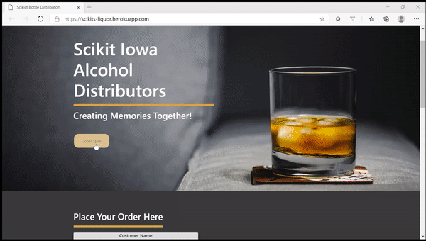

### How to read our code: ###

The repository contains the following folders:
Data folder which contains the ETL reference data loading and webscraping solution Jupyter Notebook.
Presentation folder contains the powerpoint presentation.
Folders containing Machine Learning notebooks and outputs:
- ML creation, evaluation and EDA in folder 'ML Colab Notebook'. Filename: iowa_liquor_model_C
- 2 final machine learning models saved in folders: 'drinkupiowa-C' for collaborative filtering model and 'drinkupiowa-C-popular' for popularity model

Flask application related files in the main folder.
- app.py is the flask app which renders the data from the database
- config.py which contations configurations
- Procfile for Heroku deployment configurations
- requirements.txt with all the requirements for deployment on Heroku
- a folder templates where sit the three webpages: index.html for the home page, about.html, team.html
- a folder static where sit: css/img/js

In the js folder, you will find:
- config.js - app with passwords
- logic.js - code with the js functions rendering the visualisations
- script.js

### To fire everything up....

1. Clone this repository

git clone https://github.com/amilakanishka/ECommerce-Product-Recommender-Using-Machine-Learning

2. Check the requirements.txt

$ pip install -r requirements.txt

3. You may need to install a Windows Subsystem for Linux (WSL) if you are on windows environment, [click here for instructions](https://docs.microsoft.com/en-us/windows/wsl/install-win10)

4. Run the code - Google colab
   In order to query the Google Public Data set 'Iowa Liquor Retail Sales' via the Google colab, you need to create a Project_ID at Google Cloud Platform (https://console.cloud.google.com/cloud-resource-manager) and pass the project_ID via Google colab at the point querying the dataset and loading to the dataframe.

5. Deploy to Heroku

6. Recommend till your hearts content

### Snapshot of the toolbox used to build our app: ###

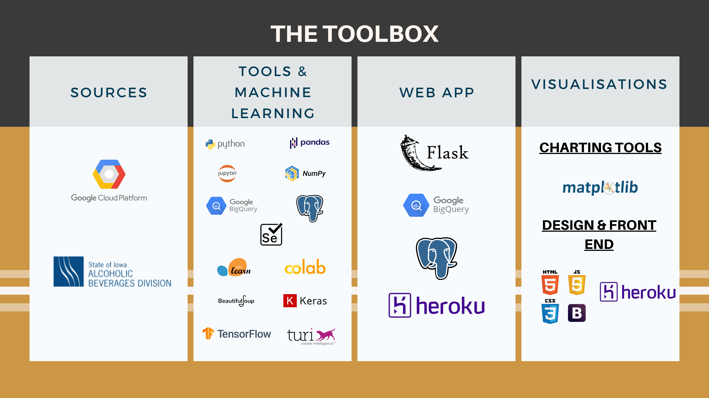

### The Data Source

The was sourced from Google Cloud Platform.  The data "contains every wholesale purchase of liquor in the State of Iowa by retailers for sale to individuals since January 1, 2012. The State of Iowa controls the wholesale distribution of liquor intended for retail sale (off-premises consumption), which means this dataset offers a complete view of retail liquor consumption in the entire state. The dataset contains every wholesale order of liquor by all grocery stores, liquor stores, convenience stores, etc., with details about the store and location, the exact liquor brand and size, and the number of bottles ordered". ^

^ Google Cloud Console - Iowa Description of the data set, the [link is here](https://console.cloud.google.com/bigquery?project=elated-channel-281600&folder=&organizationId=&p=bigquery-public-data&d=iowa_liquor_sales&page=dataset).

The data was extracted using BigQuery & postgerSQL to get ready for data cleaning using Pandas in as a Jupyter Notebook.

### Web Scraping

Missing from the data were images to load up into the webpage.  These were scraped from the [Iowa Alcohol Beverage Division Shop](https://shop.iowaabd.com/) using Beautiful Soup and Selenium.

### Exploratory Data Analysis

* Total number of transactions: 446,139
* Total number of unique customers: 1,841
* Total number of unique products: 3,846

**Top customers by purchase volume**

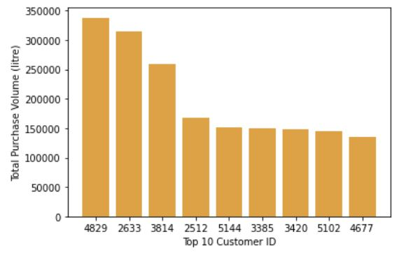

**Top customers by purchase frequency**

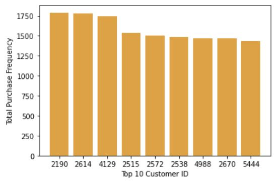

**Highest purchase volume items**

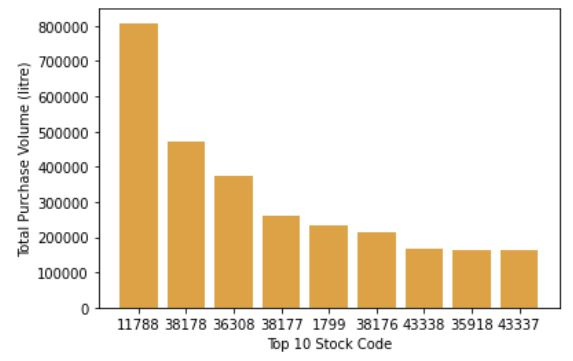

**Most commonly purchased items**

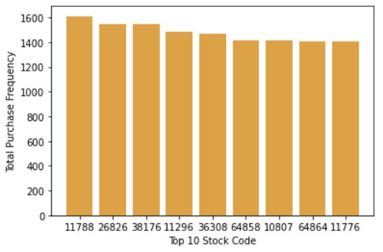

### Data Preparation

* A dummy set is created where by, we assign the value 1 where a user made a purchase. In the event where a user did not make a purchase, the value is 0. Rationale for a dummy set is so we can have a dataset that is not impacted by purchase volume and/or frequency.
* Purchase volume is normalised for each product interaction by calculating an interaction score for each customer using the feature scaling method.
* Usual checking for null and negative values.
* The 3 datasets are split into train and test sets at a ratio of 80:20

### Machine Learning

The machine learning library chosen was Turicreate.  This library was chosen as it is easy to use, fast and flexible.  It is predominately used for recommenders or image classification/similarity. We have used both popularity and collaborative filtering in building our machine learning models.

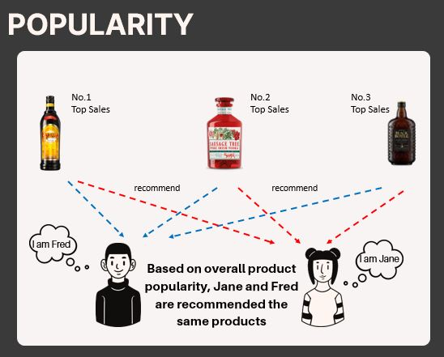

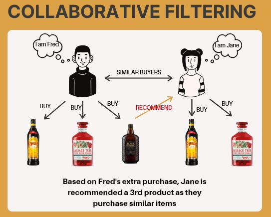

**Model Evaluation**

We select the ML model using **Cosine Similarity on Normalized Purchase Volume** approach as our final model for further tuning based on the following justifications:

1. Collaborative Filtering algorithms enable personalizations rather than providing the most popular items across all users (refer back to note on Baseline Summary).

2. This model has the highest precision and recall stats.

3. While the RMSE for this model is not the lowest at 0.19, we find that this is acceptable. The model with the lowest RMSE at 0.15 has significantly lower precision and recall and, and therefore is not a worthwhile trade-off. There is greater weight for a product recommender to have high precision and recall.

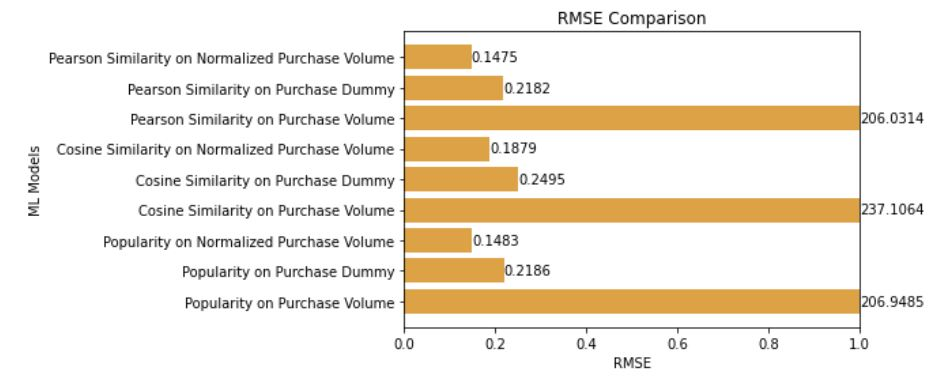

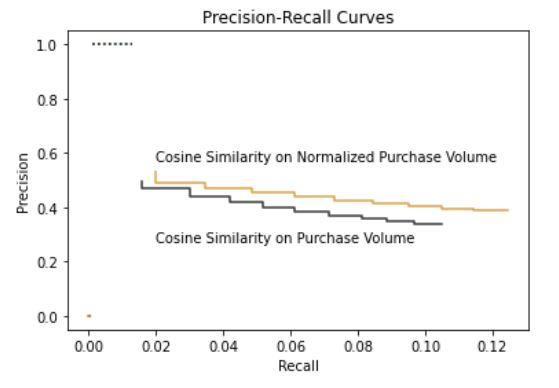

**Incorporating Pre-Defined Similar Items to our Chosen Model**

Based on our evaluation, we use our chosen model to provide nearest neighbors graph using the keyword argument nearest_items. Using the function get_similar_items, we save an SFrame with a list of items, the nearest items for each item listed and the similarity score between them. These similarity scores are then passed as a parameter in a new model to be used for recommendations.

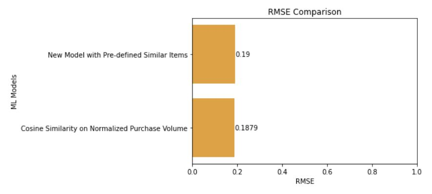

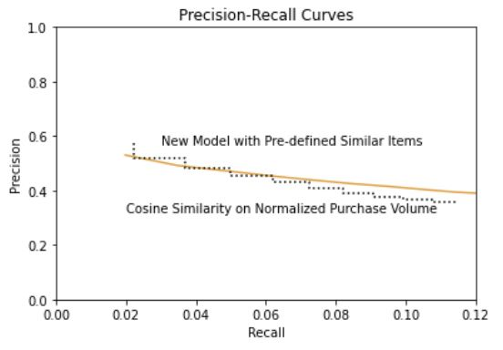

We have decided to select the new model as the final model for our product recommender for the following reasons: 

1. Marginally higher Precision-Recall
2. Model accuracy is comparable

### Flask Application & Architecture

Please see the below image for how the Flask API and the project architechture.

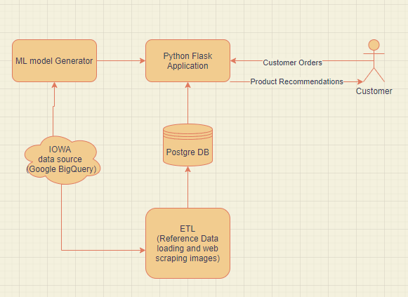

### Web App

The web app was built from scratch using HTML, CSS, Bootstrap & Javascript to make the calls on the Flask and then to the recommender.
